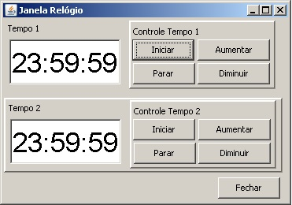

# Implementação de Relógios com Thread em Java.

## Contextualização

Um programa em java que mostra dois relógios virtuais digitais onde você poderá controlar a velocidade do tempo destes relógios. 

A interface gráfica terá a seguinte forma:

O Botão Iniciar dá início no tempo do relógio.

O Botão Parar para o tempo do relógio.

O Botão Aumentar irá acelerar a velocidade do passar do tempo no relógio.

O Botão Diminuir irá desacelerar a velocidade do passar do tempo no relógio.

Você precisará de threads para que os relógios não parem e trabalhem separadamente.

## Arquivos

- pom.xml - Arquivo de configuração da ferramenta de automação Maven.
- *.bat - Arquivos de lote(Batch) de console para tarefas compilar, executar, documentar, empacotar e limpar o projeto.